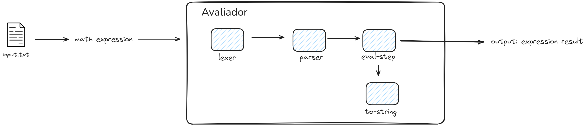
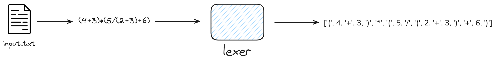
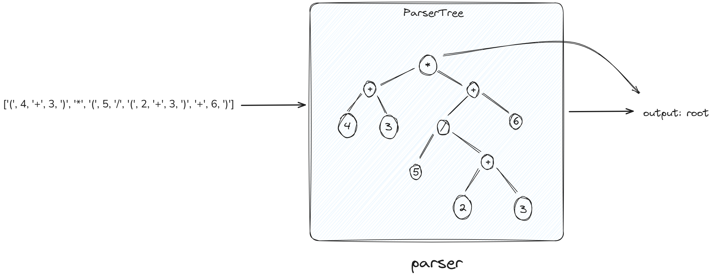
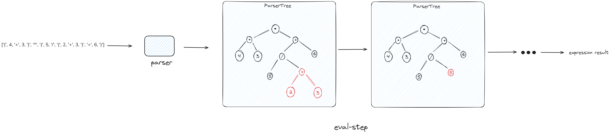

<h2 align="center"> Mathematical Expression Evaluator </h2>

 Implementation of an arithmetic expression evaluator. The work includes the development of a lexer, parser, and a step-by-step evaluator, focusing on readability, reliability, and execution cost.

 <a href="https://malbarbo.pro.br/ensino/2019/9795/trabalho-comp/" target="_blank"> Full Assignment (pt-br) </a> 

# Overall Architecture:

    

### Lexer:

    
 Receives the expression as input and returns an array of tokens

    

### Parser:

    
 Receives an array of tokens as input and builds a syntax tree that represents the original expression

    

### Eval Step:

    
 Traverses the expression tree following a bottom-up approach, resolving the entire expression in parts by evaluating results inferred by subtrees

    

### To String:

    
 Traverses the tree and prints the current state of the expression

## Created by:
* <a href="https://github.com/reidn3r" target="_blank">Reidner</a>
* <a href="https://github.com/Vitor-Padovani" target="_blank">Vitor Padovani</a>
* <a href="https://github.com/Hudson-H" target="_blank">Hudson da Silva</a>
